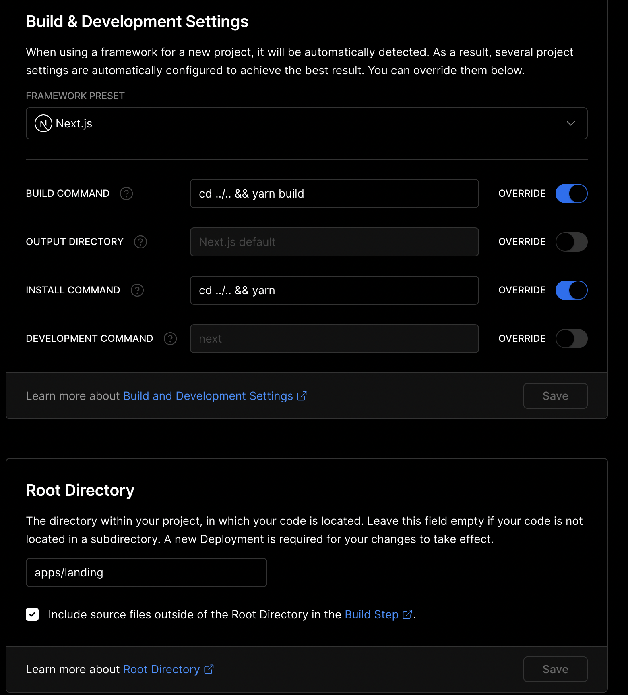

# 🐰 Walkthrough

_**Please note**: this is a work in progress! I'm creating the walkthrough as we speak!_

## Installation instructions

1. Make sure you have `brew`, `node`, `npm` and `npx`. If you don't, this is how to install them:

```
/bin/bash -c "$(curl -fsSL https://raw.githubusercontent.com/Homebrew/install/HEAD/install.sh)"
brew install node
```

2. call the init command of the cli.

```
npx sensible init
```

3. Follow the instructions on the terminal and wait for the project to be set up

## Starting a new sensible project

<iframe width="560" height="315" src="https://www.youtube.com/embed/J0EmjTW8QOY" title="YouTube video player" frameborder="0" allow="accelerometer; autoplay; clipboard-write; encrypted-media; gyroscope; picture-in-picture" allowfullscreen></iframe>

## idea, plan, todo

## VSCode Tasks

This project is recommended to be worked on from [VSCode](https://code.visualstudio.com) and has tasks set up by default. The easiest way to start developing is to run the tasks when opening the folder. This is a setting that has to be activated only once after creating the project. If this is the first time opening this project from VSCode, run the command `Manage automatic tasks in folder` and allow it. After restarting the editor (`code -r .`) your project will be ran.

## core def types/endpionts

## documentation

## server implementation

## frontend implementation

## ship

## Deployment server

## deployment expo

## Deployment web

Sensible is built on top of a yarn workspace. Your Next.js frontend relies on other packages inside the sensible project, so they also have to be installed and built.

To setup Vercel deployment correctly, select your project, go to `settings`, `general`, `build & development settings`.

There, select the following option:

- output directory: `apps/[your next project app folder]`

Also make sure that you set your root directory to the root folder of the workspace.


PS: It's also possible to do it the other way around, of course: set your root directory to `apps/web` and just `cd ../..` first for installing and building, but the first option is easier to set up.

That's it! It should now build fine. :)
